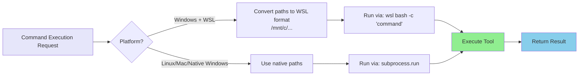
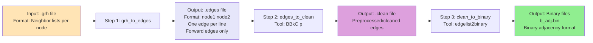

# Graph Pipeline Flowchart

This document shows the flowchart of `graph_pipeline.py` and how it processes graph files.

## Main Flowchart

```mermaid
flowchart TD
    Start([Start: graph_pipeline.py]) --> ParseArgs[Parse Command Line Arguments]
    ParseArgs --> Init[Initialize GraphPipeline]
    
    Init --> DetectOS{Detect Operating System}
    DetectOS -->|Windows| CheckWSL{WSL Available?}
    DetectOS -->|Linux/Mac| NativeMode[Native Mode]
    
    CheckWSL -->|Yes| WSLMode[WSL Mode]
    CheckWSL -->|No| NativeMode
    
    WSLMode --> SetupTools[Setup & Verify Tools]
    NativeMode --> SetupTools
    
    SetupTools --> CheckBBkC{BBkC Exists & Runnable?}
    CheckBBkC -->|No| BuildBBkC[Build BBkC]
    CheckBBkC -->|Yes| CheckEdgelist2Binary{edgelist2binary Exists & Runnable?}
    
    BuildBBkC --> BuildBBkCType{Platform?}
    BuildBBkCType -->|WSL| BuildBBkCWSL[Build via WSL:<br/>cmake + make]
    BuildBBkCType -->|Native| BuildBBkCNative[Build Native:<br/>cmake + make]
    BuildBBkCWSL --> CheckEdgelist2Binary
    BuildBBkCNative --> CheckEdgelist2Binary
    
    CheckEdgelist2Binary -->|No| BuildEdgelist2Binary[Build edgelist2binary]
    CheckEdgelist2Binary -->|Yes| CheckMode{Processing Mode?}
    
    BuildEdgelist2Binary --> BuildEdgelist2BinaryType{Platform?}
    BuildEdgelist2BinaryType -->|WSL| BuildEdgelist2BinaryWSL[Build via WSL:<br/>g++ compile]
    BuildEdgelist2BinaryType -->|Native| BuildEdgelist2BinaryNative[Build Native:<br/>g++/clang++ compile]
    BuildEdgelist2BinaryWSL --> CheckMode
    BuildEdgelist2BinaryNative --> CheckMode
    
    CheckMode -->|--batch flag| BatchMode[Batch Processing Mode]
    CheckMode -->|Single file| SingleMode[Single File Mode]
    
    BatchMode --> FindGRH[Find all .grh files in directory]
    FindGRH --> ProcessEach[For each .grh file]
    ProcessEach --> SingleMode
    
    SingleMode --> ValidateInput{Input file exists?}
    ValidateInput -->|No| Error1[Error: File not found]
    ValidateInput -->|Yes| CreateOutputDir[Create output directory]
    
    CreateOutputDir --> Step1[Step 1: GRH → Edges]
    Step1 --> ReadGRH[Read .grh file line by line]
    ReadGRH --> ParseNeighbors[Parse neighbors for each node]
    ParseNeighbors --> WriteEdges[Write .edges file<br/>Format: node1 node2<br/>Forward edges only]
    WriteEdges --> Step2[Step 2: Edges → Clean]
    
    Step2 --> RunBBkC[Run BBkC preprocessing:<br/>BBkC p edges_file]
    RunBBkC --> CheckBBkCResult{BBkC succeeded?}
    CheckBBkCResult -->|No| Error2[Error: BBkC failed]
    CheckBBkCResult -->|Yes| VerifyClean{Verify .clean file exists}
    VerifyClean -->|No| Error3[Error: No .clean file produced]
    VerifyClean -->|Yes| Step3[Step 3: Clean → Binary]
    
    Step3 --> RunEdgelist2Binary[Run edgelist2binary:<br/>edgelist2binary output_dir clean_file]
    RunEdgelist2Binary --> CheckBinaryResult{edgelist2binary succeeded?}
    CheckBinaryResult -->|No| Error4[Error: edgelist2binary failed]
    CheckBinaryResult -->|Yes| VerifyBinary{Verify b_adj.bin exists}
    VerifyBinary -->|No| Error5[Error: No binary file produced]
    VerifyBinary -->|Yes| Success[Success: Processing Complete]
    
    ProcessEach -->|More files| ProcessEach
    ProcessEach -->|All done| BatchSuccess[Batch Complete:<br/>Report success count]
    
    Error1 --> End([End: Exit with error])
    Error2 --> End
    Error3 --> End
    Error4 --> End
    Error5 --> End
    Success -->|Batch mode| ProcessEach
    Success -->|Single mode| End
    BatchSuccess --> End
    
    style Start fill:#90EE90
    style Success fill:#90EE90
    style BatchSuccess fill:#90EE90
    style Error1 fill:#FFB6C1
    style Error2 fill:#FFB6C1
    style Error3 fill:#FFB6C1
    style Error4 fill:#FFB6C1
    style Error5 fill:#FFB6C1
    style End fill:#87CEEB
```

## Tool Execution Flow

## Data Transformation Pipeline

## Output Files Produced

The pipeline produces the following files for each input `.grh` file:

1. **`.edges` file**: Text format edge list
   - Format: `node1 node2` (one edge per line)
   - Contains only forward edges (node1 < node2)

2. **`.clean` file**: Preprocessed edge list
   - Produced by BBkC preprocessing tool
   - Cleaned and optimized format

3. **`b_adj.bin`**: Binary adjacency representation
   - Produced by edgelist2binary tool
   - Binary format for efficient graph processing

## Platform Handling

- **Windows with WSL**: Converts paths to WSL format (`/mnt/c/...`) and executes via WSL
- **Windows without WSL**: Attempts native execution (may fail if tools aren't Windows-compatible)
- **Linux/macOS**: Native execution using standard Unix paths

## Error Handling

The pipeline handles errors at multiple stages:
- File not found errors
- Tool build failures
- Tool execution failures
- Missing output file verification

All errors are logged to both console and `graph_preprocessing.log` file.

